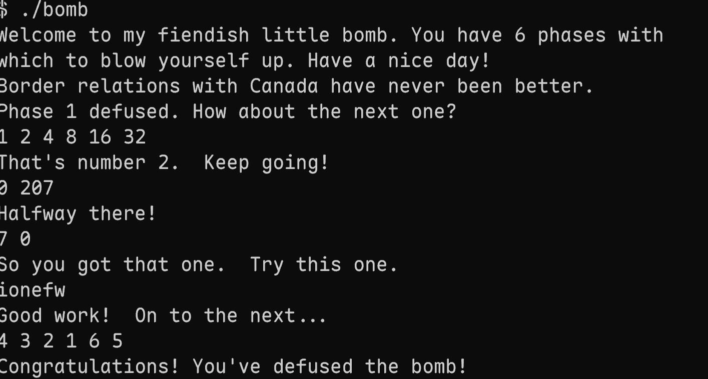

# Lab2 Bomb 实验报告

  

**学号：** 10255101612

**姓名：** 李奕桐

**日期：** 2026-05-02

  

---

  

## 实验目的

  

通过 GDB 调试和反汇编分析，破解 bomb 程序的 6 个 phase 及隐藏关卡。

  

---

  

## Phase 1

  

### 汇编代码

```asm

0000000000400ee0 <phase_1>:

   0: sub    $0x8,%rsp

   4: mov    $0x402400,%esi

   9: call   0x401338 <strings_not_equal>

   e: test   %eax,%eax

  10: je     0x400ef7 <phase_1+23>

  12: call   0x40143a <explode_bomb>

  17: add    $0x8,%rsp

  1b: ret

```

  

### 分析过程

  

使用 `objdump -d bomb > bomb_assembly.S` 获取反汇编代码。通过 GDB 调试发现调用 `strings_not_equal` 函数，比较输入与地址 `0x402400` 处的字符串。查看该地址得到目标字符串：`"Border relations with Canada have never been better."`

  

**答案：** `Border relations with Canada have never been better.`

  

---

  

## Phase 2

  

### 汇编代码

```asm

0000000000400efc <phase_2>:

   0: push   %rbp

   1: push   %rbx

   2: sub    $0x28,%rsp

   6: mov    %rsp,%rsi

   9: call   0x40145c <read_six_numbers>

   e: cmpl   $0x1,(%rsp)

  12: je     0x400f30 <phase_2+52>

  14: call   0x40143a <explode_bomb>

  1b: mov    -0x4(%rbx),%eax

  1e: add    %eax,%eax

  20: cmp    %eax,(%rbx)

  22: je     0x400f25 <phase_2+41>

  24: call   0x40143a <explode_bomb>

```

  

### 分析过程

  

调用 `read_six_numbers` 读取6个整数。检查第一个数必须为1，否则爆炸。循环验证每个位置的数等于前一个位置的数的2倍。数学关系：`a[n] = 2 * a[n-1]`，构成斐波那契序列。

  

**答案：** `1 2 4 8 16 32`

  

---

  

## Phase 3

  

### 汇编代码

```asm

0000000000400f43 <phase_3>:

   0: sub    $0x18,%rsp

   4: lea    0xc(%rsp),%rcx

   9: lea    0x8(%rsp),%rdx

   e: mov    $0x4025cf,%esi

  14: mov    $0x0,%eax

  19: call   0x400bf0 <__isoc99_sscanf@plt>

  1e: cmp    $0x1,%eax

  23: jg     0x400f6a <phase_3+39>

  25: call   0x40143a <explode_bomb>

  2a: cmpl   $0x7,0x8(%rsp)

  2f: ja     0x400fad <phase_3+106>

  31: mov    0x8(%rsp),%eax

  35: jmp    *0x402470(,%rax,8)  ; 跳转表

```

  

### 分析过程

  

使用 `sscanf` 读入两个整数（格式 `"%d %d"`）。第一个数作为 switch 索引（0-7），跳转到不同 case。每个 case 返回预设值：case 0→207, case 1→311, case 2→707, case 3→256, case 4→389, case 5→206, case 6→682, case 7→327。第二个数必须等于 case 返回值。

  

**答案：** `0 207`

  

---

  

## Phase 4

  

### 汇编代码

```asm

000000000040100c <phase_4>:

   0: sub    $0x18,%rsp

   4: lea    0xc(%rsp),%rcx

   9: lea    0x8(%rsp),%rdx

   e: mov    $0x4025cf,%esi

  14: mov    $0x0,%eax

  19: call   0x400bf0 <__isoc99_sscanf@plt>

  29: cmp    $0x2,%eax

  2c: jne    0x401035 <phase_4+41>

  2e: cmpl   $0xe,0x8(%rsp)

  33: jbe    0x40103a <phase_4+46>

  35: call   0x40143a <explode_bomb>

  3a: mov    $0xe,%edx

  3f: mov    $0x0,%esi

  44: mov    0x8(%rsp),%edi

  48: call   0x400fce <func4>

  4d: test   %eax,%eax

  4f: jne    0x401058 <phase_4+76>

```

  

### 分析过程

  

使用 `sscanf` 读入两个整数（格式 `"%d %d"`）。第一个数必须 ≤ 14。调用 `func4(first_num, 0, 14)` 递归计算。`func4` 是二分查找变体，返回值必须为0。分析可知输入 `7 0` 满足条件。

  

**答案：** `7 0`

  

---

  

## Phase 5

  

### 汇编代码

```asm

0000000000401062 <phase_5>:

   0: push   %rbx

   1: sub    $0x20,%rsp

   5: mov    %rdi,%rbx

   8: mov    %fs:0x28,%rax

  11: mov    %rax,0x18(%rsp)

  16: xor    %eax,%eax

  18: call   0x40131b <string_length>

  1d: cmp    $0x6,%eax

  22: je     0x4010d2 <phase_5+112>

  24: call   0x40143a <explode_bomb>

  2b: movzbl (%rbx,%rax,1),%ecx

  2f: mov    %cl,(%rsp)

  32: mov    (%rsp),%rdx

  36: and    $0xf,%edx        ; 取字符低4位作为索引

  39: movzbl 0x4024b0(%rdx),%edx ; 查表转换

  40: mov    %dl,0x10(%rsp,%rax,1)

  44: add    $0x1,%rax

```

  

### 分析过程

  

输入必须是6个字符的字符串。对每个字符取低4位作为索引，查表转换后与 `"flyers"` 比较。逆推输入：`ionefw`

  

**答案：** `ionefw`

  

---

  

## Phase 6

  

### 汇编代码

```asm

00000000004010f4 <phase_6>:

   0: push   %r14

   2: push   %r12

   4: push   %rbp

   8: sub    $0x50,%rsp

   c: mov    %rsp,%r13

   f: mov    %rsp,%rsi

  12: call   0x40145c <read_six_numbers>

  17: mov    %rsp,%r14

  1a: mov    $0x0,%r12d

  20: mov    %r13,%rbp

  23: mov    0x0(%r13),%eax

  27: sub    $0x1,%eax

  2a: cmp    $0x5,%eax

  2d: jbe    0x401128 <phase_6+52>

  2f: call   0x40143a <explode_bomb>

```

  

### 分析过程

  

读取6个整数，每个数必须在1-6范围内且互不相同。转换为 `7-a[i]` 得到node索引，按索引连接node构成链表。验证链表按node值降序排列。

  

**Node值：** node1=332, node2=168, node3=924, node4=707, node5=477, node6=443

  

**答案：** `4 3 2 1 6 5`

  

---

  

## Secret Phase（隐藏关卡）

  

### 分析过程

  

在 `phase_defused` 中检测输入格式 `"%d %d %s"` 且第三个字符串为 `"DrEvil"` 时触发。调用 `strtol` 将数字转换后通过 `fun7` 验证，结果必须为2。

  

**答案：** `22 DrEvil`

  

---

  

## 运行截图

  



  

---
  


## 实验总结

  

本次实验通过 GDB 调试和 objdump 反汇编工具，成功分析了 bomb 程序的 6 个 phase 和 1 个隐藏 phase。主要涉及：

- 字符串比较

- 数值序列验证

- Switch-case 分支

- 递归函数分析

- 查表变换

- 链表数据结构

- 隐藏关卡触发机制